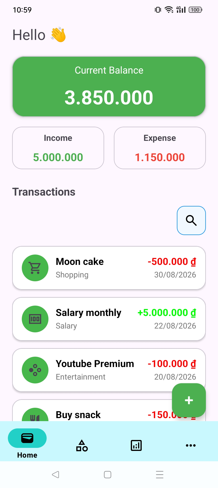
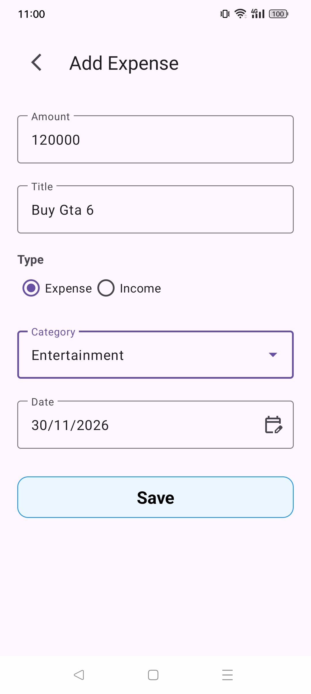
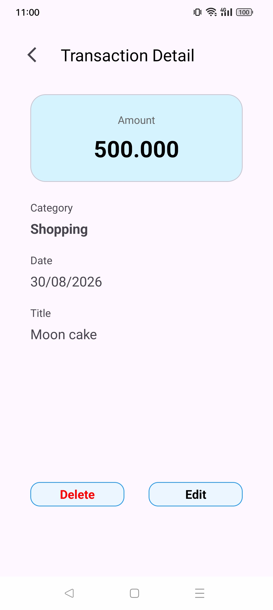
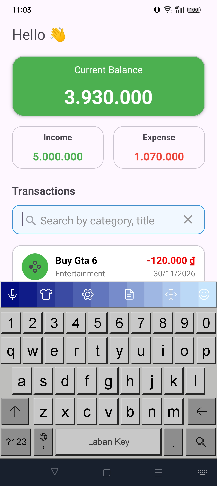
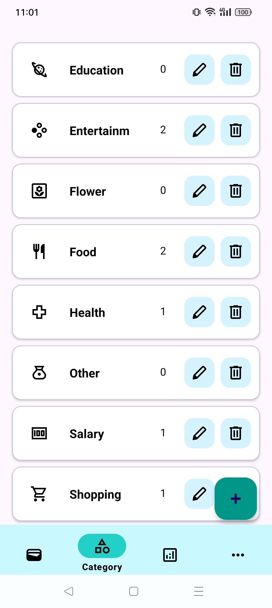
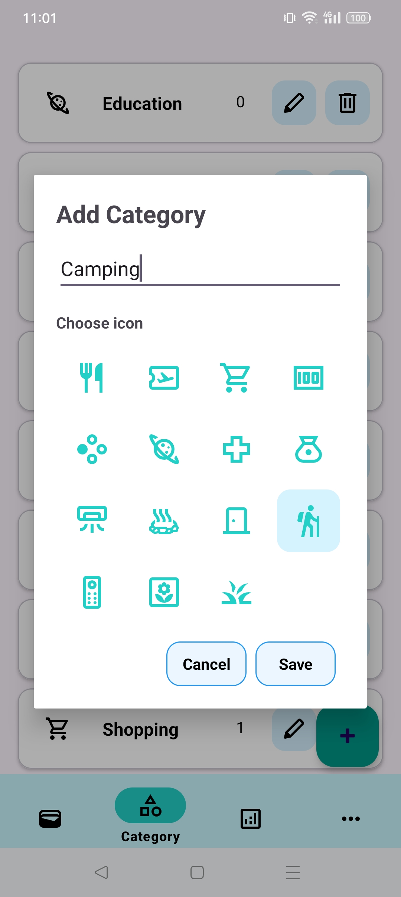
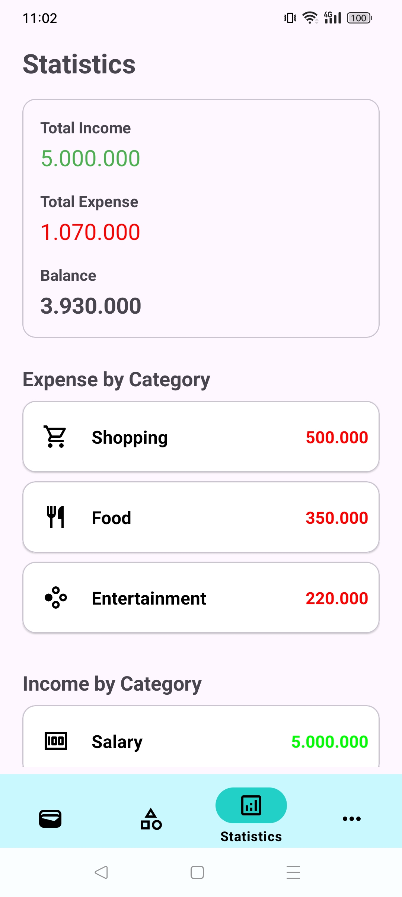
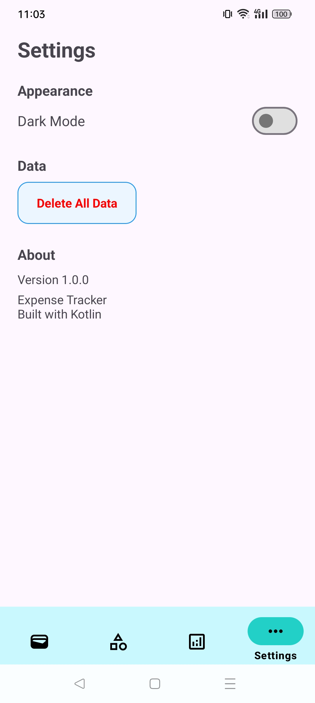
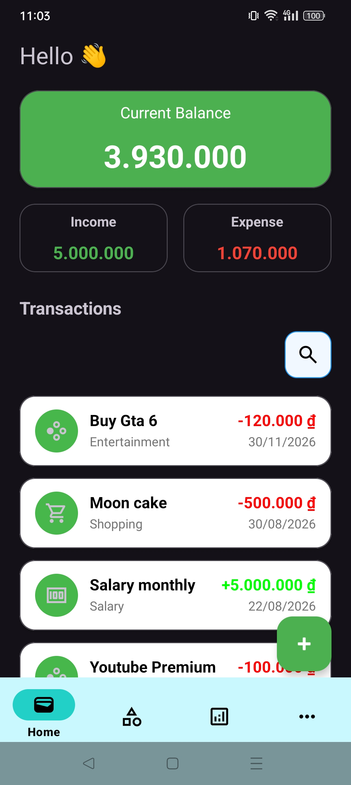

# Expense Tracker

An Android expense tracking application built with Kotlin and modern Android development practices.

Expense Tracker allows users to manage income and expenses, organize transactions by category, view financial summaries, and manage application settings.

## Screenshots
#### Home
<p align="center">
  
  
  
  
</p>

#### Category
<p align="center">
  
  

</p>

#### Statistics, Settings and Dark mode
<p align="center">
  
  
  
</p>

## Features

- Add, edit, and delete transactions
- Support both income and expense transactions
- Create, edit, and delete categories
- Prevent deletion of categories that are currently in use
- Search transactions
- View total income, total expense, and balance
- View income grouped by category
- View expenses grouped by category
- Dark mode
- Delete all application data
- Automatically initialize default categories
- Material Design UI

## Tech Stack

- Kotlin
- Android SDK
- XML
- MVVM
- Room
- Hilt
- Kotlin Coroutines
- Flow / StateFlow
- Navigation Component
- RecyclerView
- DiffUtil
- View Binding
- Material Components
- SharedPreferences

## Architecture

The application follows the MVVM architecture with a Repository layer.

```text
┌───────────────────────────┐
│         UI Layer          │
│   Fragment / Dialog       │
└─────────────┬─────────────┘
              │
              ▼
┌───────────────────────────┐
│        ViewModel          │
│   UiState / EventState    │
└─────────────┬─────────────┘
              │
              ▼
┌───────────────────────────┐
│        Repository         │
└─────────────┬─────────────┘
              │
              ▼
┌───────────────────────────┐
│           DAO             │
└─────────────┬─────────────┘
              │
              ▼
┌───────────────────────────┐
│       Room Database       │
│   Expense / Category      │
└───────────────────────────┘
```

## Project Structure

The project follows a feature-based structure combined with the MVVM architecture and Repository pattern.

```text
app/src/main/java/com/pahntd/expensetracker/
│
├── data/
│   ├── local/
│   │   ├── converter/       # Room type converters
│   │   ├── dao/             # Database access objects
│   │   ├── database/        # Room database
│   │   ├── entity/          # Database entities
│   │   ├── relation/        # Database relation/query models
│   │   └── DefaultCategories.kt
│   │
│   ├── repository/          # Data access and business operations
│   └── DatabaseInitializer.kt
│
├── di/
│   └── DatabaseModule.kt     # Hilt dependency injection
│
├── ui/
│   ├── add/                  # Add transaction
│   ├── category/             # Category management
│   ├── detail/               # Transaction details
│   ├── home/                 # Transaction list and search
│   ├── setting/              # Application settings
│   ├── splash/               # Splash screen
│   └── statistics/           # Financial statistics
│
├── utils/
│   ├── AppPreferences.kt     # Application preferences
│   ├── Extensions.kt         # Kotlin extension functions
│   └── IconMapper.kt         # Category icon mapping
│
├── ExpenseApplication.kt
└── MainActivity.kt
```

### Main Responsibilities

* **data/local** — Contains Room entities, DAOs, database configuration, type converters, and database relation models.
* **data/repository** — Provides a data-access layer between the UI and local database.
* **data/DatabaseInitializer** — Initializes default application data such as default categories.
* **di** — Provides dependencies using Hilt.
* **ui** — Contains screens, ViewModels, UI states, event states, dialogs, and RecyclerView adapters, organized by feature.
* **utils** — Contains shared utilities, preferences, extension functions, and helper classes.
* **MainActivity** — Hosts the application's navigation.

---
## Database

The application uses **Room** for local data storage.

The database contains two main entities:

* **Expense** — Stores income and expense transactions
* **Category** — Stores transaction categories

Room `Flow` is used to observe database changes and automatically update the UI.

The application also prevents deleting categories that are currently associated with transactions.

## How to Run

### Requirements

* Android Studio
* JDK 17
* Android SDK
* Android emulator or physical Android device

### Steps

1. Clone the repository.

```bash
git clone https://github.com/pahntd/ExpenseTracker.git
```

2. Open the project in Android Studio.
3. Sync Gradle dependencies.
4. Connect an Android device or start an emulator.
5. Run the `app` configuration.

No backend or API configuration is required because the application uses a local Room database.

## Future Improvements

* [ ] Recurring transactions
* [ ] Monthly and yearly reports
* [ ] Interactive statistics and charts
* [ ] Date-range filtering
* [ ] Budget management
* [ ] Data export/import
* [ ] Backup and restore
* [ ] Replace SharedPreferences with DataStore

## Author

**Phan Đức Trọng**

Android Developer

* GitHub: `https://github.com/pahntd`

