# Expense Tracker

A personal income and expense tracker with a native Android app and a Kotlin/Ktor backend backed by PostgreSQL.

The app is **offline-first**: every screen reads from a local Room database, and a WorkManager-based sync engine keeps that data in step with the user's account on the server in the background.

---

## Overview

V1 was a local-only Android app (MVVM + Room, no login, no server). V2 keeps the same MVVM + Room core and turns it into a client of a real backend, with user accounts, per-user data on the server, background sync, richer statistics and ads.

| V1 | V2 |
|---|---|
| Data lived on one device; reinstalling lost it | Email/password accounts; data stored per user in PostgreSQL |
| No authentication | JWT-based auth with an encrypted, persistent session |
| Local only | Offline-first: works without a connection, syncs in the background |
| Default categories seeded on the device | Default categories created by the server at registration |
| Basic statistics | Time filters and bar, pie and line charts |
| No monetization | AdMob banner and rewarded ads |

---

## Features

### Authentication
- Register and log in with email and password.
- The session is kept across app restarts and encrypted at rest.
- Access tokens are refreshed automatically when they expire.
- Logout warns if there are unsynced changes and offers to sync first. Logging in as a different account on the same device clears the previous account's local data.

### Transactions
- Add, edit and delete transactions, each with an amount, type (**Income** or **Expense**), category, date and optional note.
- A detail screen for each transaction.
- Search by note or category name.

### Categories
- Create, rename and delete custom categories with an icon; each shows how many transactions use it.
- Default categories (Food, Transport, Shopping, Salary, Entertainment, Education, Health, Other) are created for every new account and cannot be edited or deleted.
- A category that is still used by a transaction cannot be deleted.

### Dashboard
- All-time total income, total expense and balance.
- The transaction list with search.
- A sync status label (Syncing… / Synced / Offline / Sync failed) and a manual sync button.

### Statistics
- **Day / Week / Month / All** time filter.
- Income, expense and balance for the selected period.
- A bar chart comparing income and expense, and a pie chart of expenses by category.
- Two advanced charts, income by category and a 12-month income/expense trend, are unlocked by watching a rewarded ad.

### Works offline
Everything except login and registration works without a connection; changes sync in the background (see [Offline-first Sync](#offline-first-sync)).

### Monetization
- User consent is collected through Google's User Messaging Platform before any ad is requested.
- A banner ad on the Statistics screen.
- Rewarded ads unlock each advanced statistics feature for **3 hours**.
- Debug builds use Google's test ad units; release builds use production IDs.

### Settings
- Dark mode toggle and logout.

---

## Tech Stack

### Android

| Area | Technology |
|---|---|
| Language | Kotlin |
| UI | XML Views, ViewBinding, Material Components, Navigation Component |
| Architecture | MVVM (`ViewModel` + `StateFlow`) |
| Async | Kotlin Coroutines + Flow |
| DI | Hilt |
| Local storage | Room |
| Networking | Retrofit + OkHttp |
| Background work | WorkManager |
| Session | Proto DataStore encrypted with Tink |
| Charts | MPAndroidChart |
| Ads | Google Mobile Ads + User Messaging Platform |

`minSdk 29`, `targetSdk 35`.

### Backend

| Area | Technology |
|---|---|
| Language | Kotlin (JVM 21) |
| Web framework | Ktor |
| Data access | Exposed |
| Database | PostgreSQL |
| Migrations | Flyway |
| Auth | JWT, BCrypt password hashing |
| Packaging | Docker, Docker Compose |

---

## Architecture

```text
 Android app
 ┌──────────────────────────────────────────────────────────────┐
 │  UI (Fragments) ──► ViewModel ──► Repository ──► Room        │
 │                        ▲                           │  ▲      │
 │                        └──────── Flow ─────────────┘  │      │
 │                                                       │      │
 │  WorkManager ──► SyncManager ──── push / pull ────────┘      │
 │                      │                                       │
 │                      ▼                                       │
 │               Retrofit / OkHttp                              │
 └──────────────────────┬───────────────────────────────────────┘
                        │ HTTPS / JSON + JWT
 Backend                ▼
 ┌──────────────────────────────────────────────────────────────┐
 │  Ktor route ──► Service ──► Repository ──► PostgreSQL        │
 └──────────────────────────────────────────────────────────────┘
```

- **UI and ViewModels** render state from `StateFlow` and forward user actions. ViewModels never call the network for transaction or category data.
- **Repositories** read and write Room only, and mark every changed row as pending sync.
- **Room** is the single source of truth for the UI. Its `Flow` queries update the screens whenever data changes, whether the change came from the user or from a sync.
- **WorkManager + SyncManager** run the sync in the background: push local changes, pull the server's data, and merge it into Room.
- **Retrofit/OkHttp** attach the access token to requests and refresh it on `401`.
- **Backend** follows Route → Service → Repository. Routes parse requests, services hold the business rules, and every repository query is scoped to the authenticated user.

There is no separate domain layer; Room entities are used directly by the UI, and the only mapping boundary is between network DTOs and Room entities.

---

## Offline-first Sync

```text
Local edit ─► Room (marked pending) ─► UI updates immediately
                     │
         WorkManager (background, needs network)
                     │
             1. Push pending changes ─► server
             2. Pull the user's data  ◄─ server
             3. Merge into Room ─► UI updates
```

- **Local first.** Every write goes to Room immediately, with an `updatedAt` timestamp and a per-row `syncStatus` describing what still has to be sent. Deleting a row that has already been synced leaves a tombstone until the delete reaches the server.
- **Background sync.** WorkManager runs the sync on login, app start, network reconnect, a manual sync, and a periodic job about every 15 minutes. Only one sync runs at a time, and network or server errors are retried with backoff.
- **Push before pull.** Local changes are sent first, in an order that respects the category → transaction relationship. The pull then fetches the user's full data set and merges it into Room in a single transaction.
- **Conflicts** are resolved with **Last-Edit-Wins** on `updatedAt`, both on the server and during the client merge.
- **Stable ids.** The client generates UUIDs for new rows, so ids never need remapping and a retried create is safe.

---

## Backend / API

The backend is a stateless Ktor REST API. Each request is authenticated with a short-lived JWT access token, every query is filtered by the user id from that token, and data is stored in PostgreSQL. Flyway applies the schema migrations on startup, and the server is packaged as a Docker image.

| Endpoint | Auth | Purpose |
|---|---|---|
| `POST /register` · `POST /login` | – | Create an account / get access and refresh tokens |
| `POST /auth/refresh` · `POST /auth/logout` | – | Refresh the access token / revoke the refresh token |
| `GET · POST /categories`, `PUT · DELETE /categories/{id}` | JWT | Manage the user's categories |
| `GET · POST /transactions`, `PUT · DELETE /transactions/{id}` | JWT | Manage the user's transactions |
| `GET /health` | – | Liveness check |

Hosting, environment variables and production configuration are documented in [`backend/DEPLOYMENT.md`](backend/DEPLOYMENT.md).

---

## Screenshots

<p align="center">
   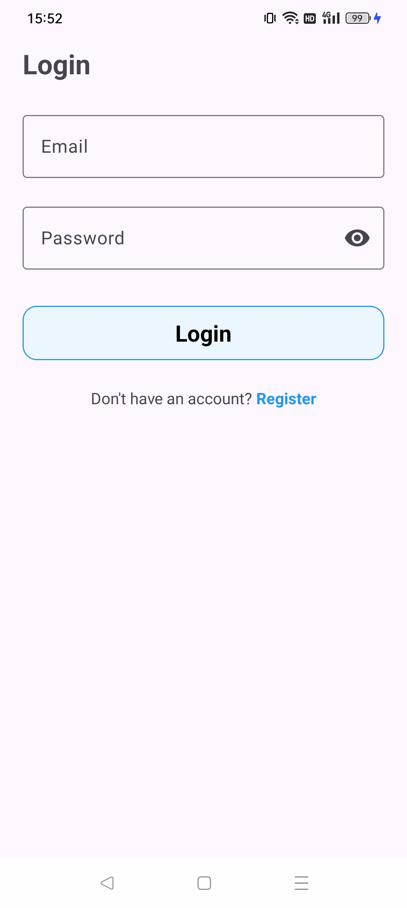
   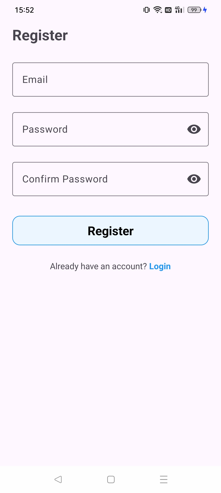
   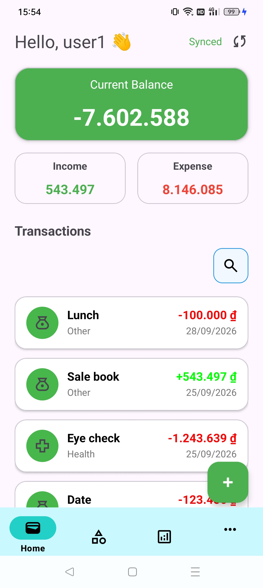
   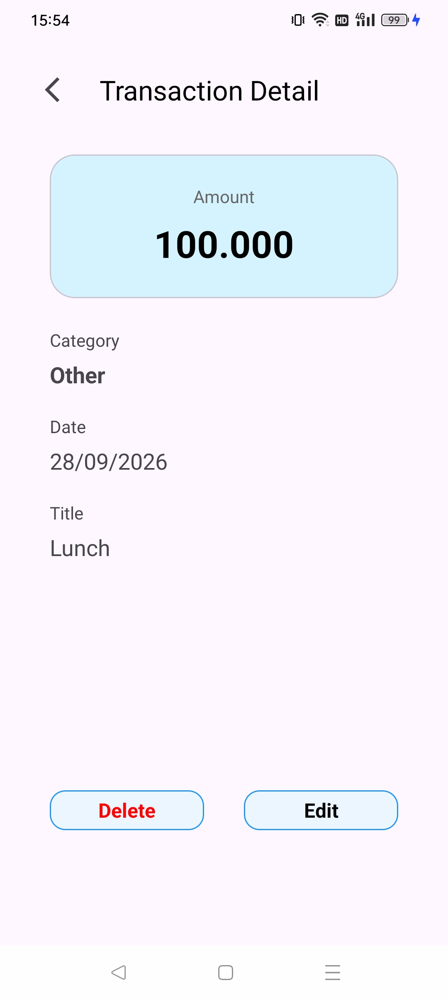
</p>

<p align="center">
   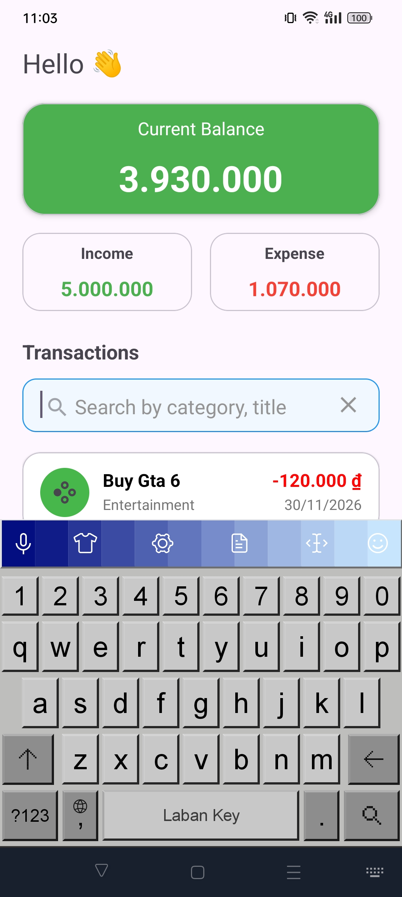
   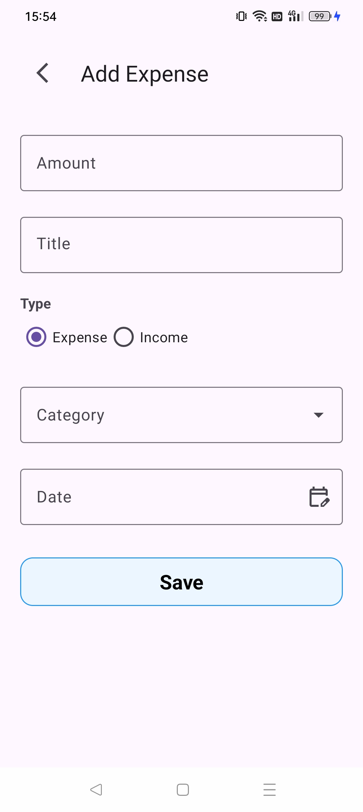
   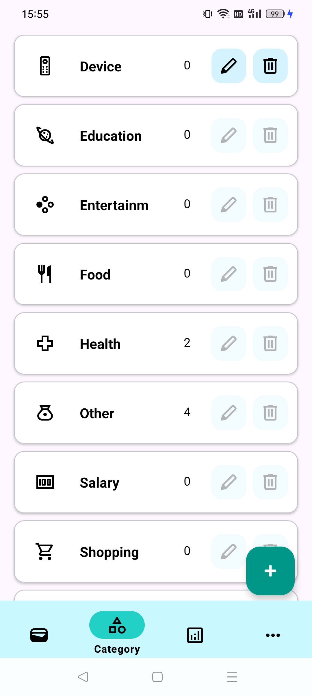
   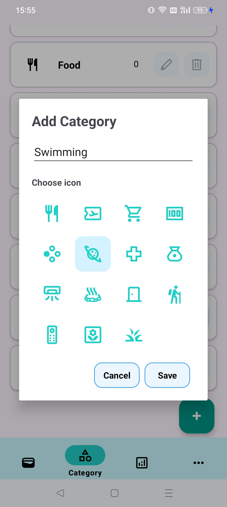

</p>
<p align="center">
   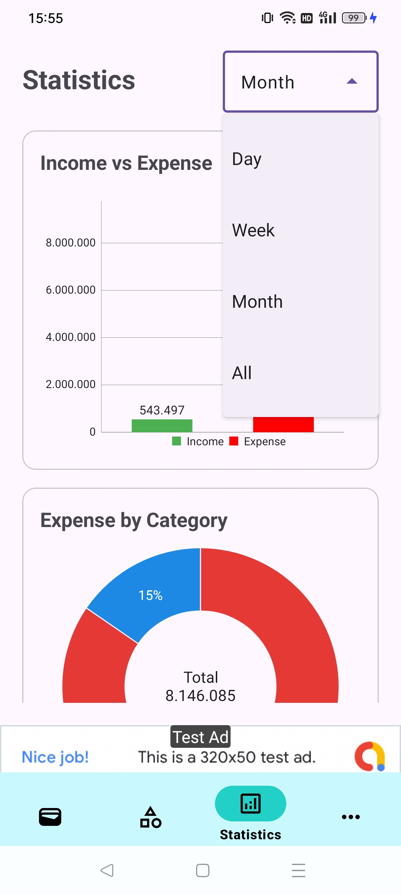
   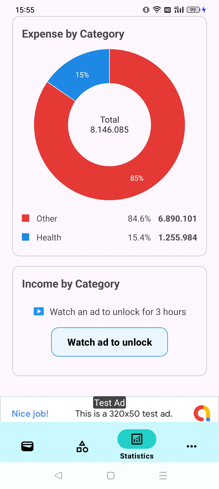
   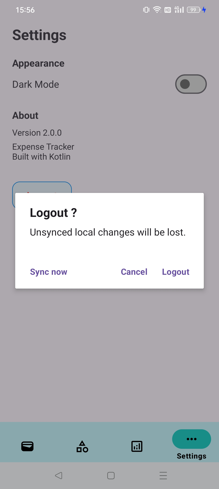
   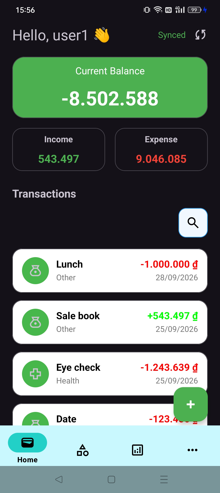
</p>

---

## Getting Started

### Requirements

- Android Studio (Ladybug or newer), JDK 17, Android SDK 35; a device or emulator on Android 10 (API 29)+
- JDK 21 for the backend
- Docker with Compose v2

### Backend

From the repository root, start PostgreSQL and the backend together:

```bash
docker compose up --build -d
curl http://localhost:8080/health      # → {"status":"ok"}
```

`docker-compose.yml` uses development-only placeholder credentials. Flyway creates the schema automatically on startup.

To run the backend with Gradle while editing its code, start only the database and set a JWT secret:

```bash
docker compose up -d postgres
cd backend
export JWT_SECRET="<any-local-dev-secret>"   # PowerShell: $env:JWT_SECRET="<any-local-dev-secret>"
./gradlew run
```

Without `APP_ENV`, the backend runs in development mode and connects to the local Compose database.

### Android

1. Open the **`android/`** folder in Android Studio.
2. Create `android/keystore.properties`. The build reads the release signing config even for debug builds, so the build fails without it. For local development the Android debug keystore is enough:
   ```properties
   storeFile=/absolute/path/to/.android/debug.keystore
   storePassword=android
   keyAlias=androiddebugkey
   keyPassword=android
   ```
3. Point the debug build at your backend. Update the debug `BASE_URL` in `app/build.gradle.kts` **and** the allowed cleartext host in `app/src/debug/res/xml/network_security_config.xml`:
   - emulator: `http://10.0.2.2:8080/`
   - physical device on the same Wi-Fi: `http://<your-PC-LAN-IP>:8080/`
4. Run the `app` configuration, register an account and log in. The first sync downloads the default categories.

Debug builds use test ad units, so no AdMob account is needed. Real secrets (`JWT_SECRET`, database passwords, signing keys) are never committed.

---

## Project Structure

```text
ExpenseTracker/
├── android/
│   ├── app/src/main/java/com/pahntd/expensetracker/
│   │   ├── ads/          # consent, banner and rewarded ads
│   │   ├── data/         # Room, Retrofit, repositories, session, sync
│   │   ├── di/           # Hilt modules
│   │   ├── ui/           # screens: auth, home, add, detail, category, statistics, settings
│   │   └── utils/
│   └── screenshots/      # README images
├── backend/
│   ├── src/main/kotlin/
│   │   ├── api/          # request/response DTOs
│   │   ├── auth/         # JWT and password hashing
│   │   ├── database/     # Flyway, connection, Exposed tables
│   │   ├── repository/
│   │   ├── route/
│   │   └── service/
│   ├── Dockerfile
│   └── DEPLOYMENT.md
└── docker-compose.yml    # local PostgreSQL + backend
```

---

## Known Limitations

- **One account per device.** Logging out, or logging in as another user, wipes local data, including changes that were never synced (the logout dialog warns about this).
- **Login and registration need the network.** Everything else works offline.
- **Sync is not immediate.** A local edit is pushed at the next sync trigger, not right away.
- **Full-snapshot pull.** Each sync downloads all of the user's categories and transactions; there is no incremental pull.
- **Last-Edit-Wins depends on device clocks**, and the whole row wins; there is no field-level merge.
- **Temporary hosting.** The release build points to a Render Free-tier deployment that sleeps when idle and has no database backups. It is a verification environment, not a permanent production setup.
- **Limited tests.** The sync engine has no automated tests yet.

Planned directions include budgets, sync right after edits with incremental pulls, better test coverage, and a permanent production environment.

---

## Key Design Decisions

- **Offline-first with Room as the source of truth.** Expenses are often recorded on the go, so the UI should never wait for the network. The cost is a sync engine to build and maintain.
- **WorkManager for sync.** It provides network constraints, survives process death, retries with backoff, and guarantees only one sync runs at a time.
- **Per-row sync status instead of an outbox table.** Pending state lives next to the data, is easy to query, and needs no second table to keep consistent. Only the latest state of a row is pushed, which is all Last-Edit-Wins needs.
- **Client-generated UUIDs.** Rows get their final id offline, so there is no id remapping, and a create retried after a lost response is safe.
- **Last-Edit-Wins.** It is simple and predictable for a single-user app where conflicts mostly come from the same person on two devices, at the cost of relying on device clocks.
- **Ktor + PostgreSQL + Flyway.** Kotlin on both sides, relational integrity through foreign keys and unique constraints, and repeatable migrations applied at startup.

---

## Author

**Phan Đức Trọng**, Android Developer · GitHub: [pahntd](https://github.com/pahntd)
